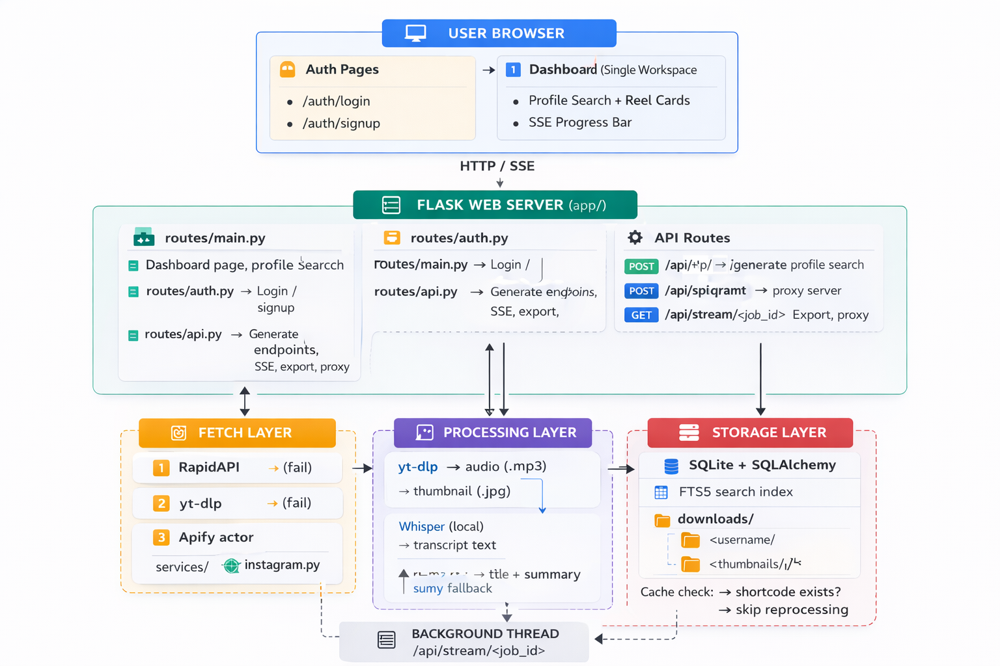
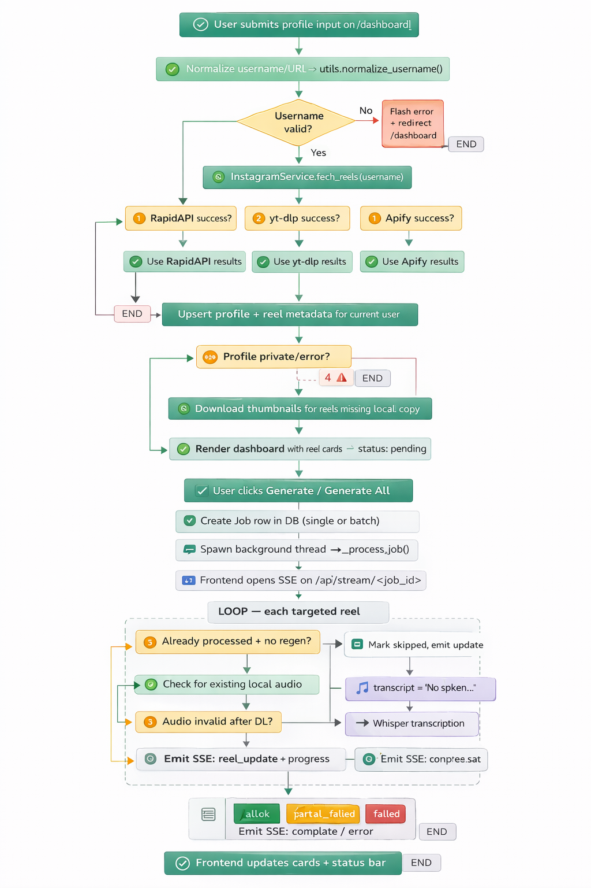

<div align="center">

# 🎬 Insta Sum

### *Turn any public Instagram account into a searchable, AI-powered content library*

[](https://python.org)
[](https://flask.palletsprojects.com)
[](https://sqlite.org)
[](LICENSE)
[]()

<br/>

> **Insta Sum** fetches Reels metadata from any public Instagram profile, then lets you selectively transcribe and summarize content on demand — using local Whisper AI for transcription and OpenAI for intelligent summaries. Built for marketers, researchers, and content teams who need reel intelligence without manually watching every video.

<br/>

[🚀 Quick Start](#9-installation-and-setup) · [🏗️ Architecture](#4-system-architecture-diagram) · [⚙️ Configuration](#10-environment-variables) · [🗺️ API Reference](#14-api-endpoints-reference) · [🐛 Troubleshooting](#17-troubleshooting)

</div>

---

## 📋 Table of Contents

| # | Section |
|---|---------|
| 3 | [✨ Features](#3-features) |
| 4 | [🏗️ System Architecture](#4-system-architecture-diagram) |
| 5 | [🔄 Processing Pipeline](#5-processing-pipeline-flowchart) |
| 6 | [🛠️ Tech Stack](#6-tech-stack) |
| 7 | [📁 Project Structure](#7-project-structure) |
| 8 | [📋 Prerequisites](#8-prerequisites) |
| 9 | [🚀 Installation & Setup](#9-installation-and-setup) |
| 10 | [🔑 Environment Variables](#10-environment-variables) |
| 11 | [🍪 Instagram Cookies Setup](#11-instagram-cookies-setup) |
| 12 | [🗝️ API Keys Setup](#12-api-keys-setup) |
| 13 | [💡 How It Works](#13-how-it-works-plain-english) |
| 14 | [🗺️ API Endpoints Reference](#14-api-endpoints-reference) |
| 15 | [🎙️ Whisper Model Guide](#15-whisper-model-selection-guide) |
| 16 | [⚠️ Known Limitations](#16-known-limitations) |
| 17 | [🐛 Troubleshooting](#17-troubleshooting) |
| 18 | [🤝 Contributing](#18-contributing) |
| 19 | [📄 License](#19-license) |
| 20 | [🙏 Acknowledgements](#20-acknowledgements) |

---

## 3. ✨ Features

<table>
<tr>
<td width="50%">

**🔍 Smart Profile Discovery**
- Accepts username, `@username`, or full Instagram URL
- Metadata-first load — no forced auto-transcription on search
- Profile cache to avoid redundant fetches

**🛡️ Resilient 3-Layer Fetching**
- **Layer 1** → RapidAPI (primary)
- **Layer 2** → yt-dlp with cookies (fallback)
- **Layer 3** → Apify actor (last resort)
- Auto-falls to next layer on failure

**🎙️ Local Transcription**
- OpenAI Whisper runs entirely offline
- No API key required for transcription
- Configurable model size (tiny → large)

</td>
<td width="50%">

**🤖 AI-Powered Summaries**
- Title + detailed summary per reel
- OpenAI Chat Completions (standard or Azure)
- `sumy` offline fallback when no API key is set

**⚡ Real-Time Processing**
- Per-reel `Generate` and `Regenerate` controls
- Profile-level `Generate All` / `Regenerate All`
- Live Server-Sent Events (SSE) progress streaming

**💾 Data Management**
- SQLite persistence with FTS5 full-text search
- CSV and JSON export for any profile
- User-isolated data with local auth
- WAL mode + retry logic for concurrency safety

</td>
</tr>
</table>

**Additional capabilities:** local thumbnail proxy, in-browser audio playback, transcript toggle views, deduped audio/thumbnail downloads, hCaptcha support, and rate limiting via Flask-Limiter.

---

## 4. 🏗️ System Architecture Diagram

> See `docs/architectural_diagram.png` for the visual version. The full logical flow is described below.



---

## 5. 🔄 Processing Pipeline Flowchart



---

## 6. 🛠️ Tech Stack

| Layer | Technology | Version | Purpose |
|-------|-----------|---------|---------|
| 🌐 **Web Framework** | Flask | 3.x | Routing, templates, SSE streaming |
| 🗄️ **ORM** | SQLAlchemy | 2.x | Models, queries, persistence |
| 💾 **Database** | SQLite + FTS5 | — | Persistent storage + full-text search |
| 🔒 **Auth** | Werkzeug + Flask session | — | Local email/password auth |
| 🚦 **Rate Limiting** | Flask-Limiter | optional | Request throttling |
| 📸 **Fetch: Primary** | RapidAPI Instagram Scraper | — | Reel metadata source (Layer 1) |
| 📸 **Fetch: Secondary** | yt-dlp | latest | Metadata + audio/thumbnail download (Layer 2) |
| 📸 **Fetch: Tertiary** | Apify instagram-scraper | — | Cloud-based scraping fallback (Layer 3) |
| 🎞️ **Media** | FFmpeg / FFprobe | — | Audio extraction and postprocessing |
| 🎙️ **Transcription** | OpenAI Whisper (local) | — | Offline speech-to-text, no API key needed |
| 🤖 **AI Summaries** | OpenAI Chat Completions | — | Title + detailed summary generation |
| ☁️ **AI Alt.** | Azure OpenAI | optional | Enterprise-hosted model endpoint |
| 📝 **Fallback Summary** | sumy + nltk | — | Offline summarization when AI unavailable |
| 🌐 **HTTP Clients** | requests, httpx | — | External API calls |
| 🖼️ **Frontend** | Jinja2 + HTML/CSS + Vanilla JS | — | Dashboard UI and interactions |
| ⚡ **Live Updates** | Server-Sent Events (SSE) | — | Real-time job progress streaming |
| ⚙️ **Config** | python-dotenv | — | `.env` loading and environment management |

---

## 7. 📁 Project Structure

```
Insta Sum/
│
├── app/                              # 📦 Core application package
│   ├── __init__.py                   #    Flask app factory + blueprint registration
│   ├── config.py                     #    Central config from environment variables
│   ├── db.py                         #    SQLAlchemy init, schema guards, FTS helpers
│   ├── extensions.py                 #    Flask-Limiter setup
│   ├── models.py                     #    DB models: User / Profile / Job / Reel / ReelError
│   │
│   ├── routes/                       # 🛣️  Route blueprints
│   │   ├── main.py                   #    Dashboard pages + profile search flow
│   │   ├── auth.py                   #    Login / signup / logout
│   │   └── api.py                    #    Generate, SSE, media serving, export, proxy
│   │
│   ├── services/                     # ⚙️  Business logic layer
│   │   ├── auth.py                   #    current_user(), login_required(), session helpers
│   │   ├── instagram.py              #    3-layer reel metadata fetch strategy
│   │   ├── media.py                  #    Audio/thumbnail download + dedup + ffmpeg detection
│   │   ├── transcription.py          #    Whisper model loading and transcription
│   │   ├── summarization.py          #    OpenAI/Azure summary + local fallback
│   │   ├── captcha.py                #    hCaptcha verification helper
│   │   ├── jobs.py                   #    Background worker loop utilities
│   │   └── utils.py                  #    Normalization and utility functions
│   │
│   ├── static/
│   │   ├── styles.css                # 🎨 App styles
│   │   └── app.js                    #    SSE client, UI interactions, filters/sorting
│   │
│   └── templates/                    # 🖼️  Jinja2 templates
│       ├── base.html                 #    Shared layout shell
│       ├── auth_login.html           #    Login page
│       ├── auth_signup.html          #    Signup page
│       ├── dashboard.html            #    Main workspace (active)
│       └── partials/
│           ├── reel_card.html        #    Reel card UI + actions
│           ├── reel_list.html        #    List partial
│           └── progress.html         #    Progress UI partial
│
├── downloads/                        # 💽 Local media cache (auto-created, gitignored)
│   └── <instagram_username>/
│       ├── audio/                    #    Downloaded reel audio files (.mp3)
│       └── thumbnails/               #    Downloaded reel thumbnails (.jpg)
│
├── tmp/                              # 🗂️  Temporary files and cache artifacts
├── run.py                            # ▶️  App entry point
├── requirements.txt                  # 📦 Python dependencies
├── insta_sum.db                      # 🗄️  SQLite database (auto-generated)
├── .env                              # 🔑 Local environment variables (private, gitignored)
├── .env.example                      # 📋 Environment variable template
├── .gitignore                        # 🚫 Excludes env, db, downloads, temp
└── README.md                         # 📖 This file
```

---

## 8. 📋 Prerequisites

Before running Insta Sum, ensure the following are installed on your system:

| Requirement | Minimum Version | Notes |
|-------------|----------------|-------|
| Python | 3.9+ (3.10+ recommended) | Core runtime |
| pip | latest | Package manager |
| Git | any | Version control |
| FFmpeg + FFprobe | any stable | **Required** for audio extraction |

### Install Prerequisites

**🪟 Windows (PowerShell)**
```powershell
winget install Git.Git
winget install Python.Python.3.11
winget install Gyan.FFmpeg
```

**🍎 macOS (Homebrew)**
```bash
brew install git python ffmpeg
```

**🐧 Ubuntu / Debian**
```bash
sudo apt update && sudo apt install -y git python3 python3-venv python3-pip ffmpeg
```

> ⚠️ **Warning:** Without `ffmpeg` and `ffprobe` in your PATH (or configured via `FFMPEG_LOCATION`), audio extraction and transcription will fail silently.

---

## 9. 🚀 Installation & Setup

### Step 1 — Clone the repository
```bash
git clone <your-repo-url>
cd "Insta Sum"
```

### Step 2 — Create and activate a virtual environment

**Windows (PowerShell)**
```powershell
python -m venv .venv
.\.venv\Scripts\Activate.ps1
```

**macOS / Linux**
```bash
python3 -m venv .venv
source .venv/bin/activate
```

### Step 3 — Install dependencies
```bash
python -m pip install --upgrade pip setuptools wheel
pip install -r requirements.txt
```

### Step 4 — Create your `.env` file
```bash
# Windows
copy .env.example .env

# macOS / Linux
cp .env.example .env
```
Then open `.env` and fill in your API keys (see [Section 10](#10-environment-variables)).

### Step 5 — Configure at least one working fetch path

You need **at minimum one** of these working to fetch Reels:

```
RAPIDAPI_KEY=...          # Recommended (Layer 1)
IG_COOKIES_FILE=./instagram_cookies.txt   # Needed for yt-dlp fallback (Layer 2)
APIFY_TOKEN=...           # For Apify fallback (Layer 3)
```

And **at minimum one** of these for summaries:
```
OPENAI_API_KEY=...        # Standard OpenAI
AZURE_OPENAI_*=...        # Azure OpenAI alternative
# If neither is set, the app falls back to local sumy summarization
```

### Step 6 — Initialize the database
The schema is created automatically on startup. To initialize manually:
```bash
python -c "from app import create_app; create_app(); print('Database initialized')"
```

### Step 7 — Add Instagram cookies (recommended)
```bash
# Place your exported cookies file in the project root
# Then set in .env:
IG_COOKIES_FILE=./instagram_cookies.txt
```
See [Section 11](#11-instagram-cookies-setup) for how to export this file.

### Step 8 — Run the app
```bash
python run.py
```

Open your browser at: **`http://127.0.0.1:5000`**

> 💡 **Tip:** During local development, set `RATELIMIT_ENABLED=0` in `.env` to avoid self-throttling.

---

## 10. 🔑 Environment Variables

> ⚠️ You need at least one working fetch path and one summary path. Everything else is optional.

### Quick Reference

| Variable | Required? | Description | Source |
|----------|-----------|-------------|--------|
| `SECRET_KEY` | Recommended | Flask session secret key | `python -c "import secrets; print(secrets.token_hex(32))"` |
| `FLASK_ENV` | Optional | `development` or `production` | Your choice |
| `DATABASE_URL` | Optional | SQLAlchemy URI (default: SQLite) | Your choice |
| `OPENAI_API_KEY` | Optional* | OpenAI key for summaries | [platform.openai.com/api-keys](https://platform.openai.com/api-keys) |
| `OPENAI_SUMMARY_MODEL` | Optional | Model name (default: `gpt-4o-mini`) | OpenAI model docs |
| `AZURE_OPENAI_ENDPOINT` | Optional* | Azure OpenAI endpoint URL | Azure Portal |
| `AZURE_OPENAI_API_KEY` | Optional* | Azure OpenAI API key | Azure Portal |
| `AZURE_OPENAI_API_VERSION` | Optional | API version (default: `2024-12-01-preview`) | Azure docs |
| `AZURE_OPENAI_DEPLOYMENT` | Optional* | Azure deployment name | Azure OpenAI Studio |
| `RAPIDAPI_KEY` | Optional* | Primary Instagram fetcher key | [rapidapi.com](https://rapidapi.com) |
| `APIFY_TOKEN` | Optional* | Third-layer fetcher token | [console.apify.com](https://console.apify.com/account/integrations) |
| `IG_COOKIES_FILE` | Optional* | Cookies file path for yt-dlp | Exported from browser |
| `WHISPER_MODEL` | Optional | Local Whisper model (default: `base`) | See [Section 15](#15-whisper-model-selection-guide) |
| `FFMPEG_LOCATION` | Optional | Explicit path to ffmpeg binary | Local system path |
| `MAX_REELS` | Optional | Max reels fetched per profile (default: `100`) | Performance tuning |
| `MAX_REEL_SECONDS` | Optional | Skip reels longer than N seconds (default: `180`) | Cost/latency tuning |
| `DOWNLOADS_DIR` | Optional | Base folder for media (default: `./downloads`) | Your choice |
| `RATELIMIT_ENABLED` | Optional | Enable rate limiting: `0` or `1` | Your choice |
| `CAPTCHA_ENABLED` | Optional | Enable hCaptcha: `0` or `1` | Your choice |
| `HCAPTCHA_SITEKEY` | Optional | hCaptcha public site key | [dashboard.hcaptcha.com](https://dashboard.hcaptcha.com) |
| `HCAPTCHA_SECRET` | Optional | hCaptcha secret key | [dashboard.hcaptcha.com](https://dashboard.hcaptcha.com) |
| `EXPORT_MAX_ROWS` | Optional | Export row limit (default: `5000`) | Your choice |
| `DISABLE_LOCAL_WHISPER` | Optional | Disable local Whisper path: `0` or `1` | Debugging |

### Full `.env.example`

```bash
# ── Flask / App ────────────────────────────────────────────────────────────
FLASK_ENV=development
SECRET_KEY=change-me
DATABASE_URL=sqlite:///insta_sum.db
SESSION_COOKIE_SAMESITE=Lax
SESSION_COOKIE_SECURE=0

# ── OpenAI (standard) ──────────────────────────────────────────────────────
OPENAI_API_KEY=
OPENAI_SUMMARY_MODEL=gpt-4o-mini
OPENAI_WHISPER_MODEL=whisper-1

# ── Azure OpenAI (optional alternative to OPENAI_API_KEY) ──────────────────
AZURE_OPENAI_ENDPOINT=
AZURE_OPENAI_API_KEY=
AZURE_OPENAI_API_VERSION=2024-12-01-preview
AZURE_OPENAI_DEPLOYMENT=

# ── Instagram Fetchers ─────────────────────────────────────────────────────
RAPIDAPI_KEY=
APIFY_TOKEN=
IG_COOKIES_FILE=./instagram_cookies.txt
PROFILE_CACHE_MINUTES=60

# ── Processing / Media ─────────────────────────────────────────────────────
DOWNLOADS_DIR=./downloads
TEMP_DIR=./tmp
WHISPER_MODEL=base
FFMPEG_LOCATION=
MAX_REELS=100
MAX_REEL_SECONDS=180
CACHE_TTL_HOURS=24

# ── Rate Limiting ──────────────────────────────────────────────────────────
RATELIMIT_ENABLED=0
RATELIMIT_DEFAULT=200 per day

# ── Captcha (optional) ─────────────────────────────────────────────────────
CAPTCHA_ENABLED=0
HCAPTCHA_SITEKEY=
HCAPTCHA_SECRET=

# ── Worker / Polling ───────────────────────────────────────────────────────
FETCH_RETRY_MAX=3
FETCH_RETRY_BASE=1.5
WORKER_POLL_SECONDS=2
STALE_JOB_MINUTES=30
STATUS_POLL_SECONDS=2
LIST_POLL_SECONDS=5

# ── Export ─────────────────────────────────────────────────────────────────
EXPORT_MAX_ROWS=5000

# ── Debug ──────────────────────────────────────────────────────────────────
DISABLE_LOCAL_WHISPER=0
```

---

## 11. 🍪 Instagram Cookies Setup

### Why This Matters

Instagram aggressively blocks unauthenticated scraping patterns. Providing a fresh browser cookie jar allows yt-dlp (Layer 2) to access content metadata and media URLs far more reliably than anonymous requests.

### How to Export Your Cookies

```
Step 1 → Log in to Instagram in Chrome or any Chromium browser
Step 2 → Install the extension: "Get cookies.txt LOCALLY"
Step 3 → Navigate to instagram.com
Step 4 → Click the extension icon → Export cookies
Step 5 → Save the file as: instagram_cookies.txt
Step 6 → Place it in the project root directory
Step 7 → Set in .env: IG_COOKIES_FILE=./instagram_cookies.txt
```

### Maintenance

| Event | Action |
|-------|--------|
| Every 2–3 weeks | Re-export and replace `instagram_cookies.txt` |
| yt-dlp requests start failing | Re-export immediately |
| You log out of Instagram | Re-export (session cookie invalidated) |

> ⚠️ **Warning:** Never commit `instagram_cookies.txt` to Git. It contains active session credentials that give full account access. It is already listed in `.gitignore` — keep it that way.

---

## 12. 🗝️ API Keys Setup

### 🤖 OpenAI (Summary Generation)

1. Create or sign in at [platform.openai.com](https://platform.openai.com/)
2. Go to [API Keys](https://platform.openai.com/api-keys) → Create new key
3. Add to `.env`: `OPENAI_API_KEY=sk-...`
4. Optionally set: `OPENAI_SUMMARY_MODEL=gpt-4o-mini` (default, cost-effective)

> 💡 **Tip:** `gpt-4o-mini` offers the best cost-to-quality ratio for summarization.

---

### ☁️ Azure OpenAI (Enterprise Alternative)

1. Create an Azure OpenAI resource in [Azure Portal](https://portal.azure.com)
2. Deploy a model in Azure OpenAI Studio
3. Add all four variables to `.env`:

```bash
AZURE_OPENAI_ENDPOINT=https://your-resource.openai.azure.com/
AZURE_OPENAI_API_KEY=your-key
AZURE_OPENAI_API_VERSION=2024-12-01-preview
AZURE_OPENAI_DEPLOYMENT=your-deployment-name
```

---

### 📡 RapidAPI (Primary Reel Fetcher — Layer 1)

1. Sign up at [rapidapi.com](https://rapidapi.com)
2. Search for an **Instagram Reels / Profile Scraper** API
3. Subscribe to a free tier plan
4. Copy your key to `.env`: `RAPIDAPI_KEY=...`

---

### 🕷️ Apify (Third-Layer Fallback)

1. Sign up at [apify.com](https://apify.com)
2. Go to [Account → Integrations](https://console.apify.com/account/integrations)
3. Copy your API token to `.env`: `APIFY_TOKEN=...`

> 💡 **Tip:** Configure at least two fetch layers. When one provider is rate-limited, the app automatically falls through to the next — no manual intervention needed.

---

## 13. 💡 How It Works (Plain English)

**Search, don't wait.** When a signed-in user types a username or Instagram URL and hits Search, the app fetches only profile details and reel metadata first — lightweight information like titles, thumbnails, dates, and view counts. This loads quickly so the workspace feels instant, rather than forcing you to wait for a full transcript pipeline before seeing anything.

**You choose what to process.** Once the reel cards appear, nothing is automatically transcribed. You decide: click Generate on a single reel, or hit Generate All to queue the entire profile. This keeps costs predictable and lets you focus on only the content that matters.

**The pipeline runs silently in the background.** Each generation request kicks off a background job. For every targeted reel, the app checks whether audio already exists locally. If not, it downloads the audio track using yt-dlp. Whisper then transcribes the speech locally — no cloud transcription API, no per-minute charges. Once the transcript exists, it's sent to OpenAI to produce a concise title and a detailed summary. If no OpenAI key is configured, the app falls back to local summarization with `sumy` so work can still complete.

**Results are live, persistent, and exportable.** Progress streams directly to your browser via Server-Sent Events, so you can watch each reel complete in real time. Everything is saved to SQLite and tied to your account, meaning results are instant on any repeat visit. When you're done, export the entire profile as a CSV or JSON file for use in spreadsheets, reports, or downstream tools.

---

## 14. 🗺️ API Endpoints Reference

| Method | Route | Description | Response |
|--------|-------|-------------|----------|
| `GET` | `/` | Entry route, redirects to login or dashboard | Redirect |
| `GET` | `/dashboard` | Main workspace page | HTML |
| `POST` | `/dashboard/search` | Search username/URL and load metadata | Redirect |
| `POST` | `/analyze` | Legacy alias to dashboard search | Redirect |
| `GET` | `/results/<path:username>` | Legacy route, redirects to dashboard profile | Redirect |
| `GET` | `/auth/login` | Login page | HTML |
| `POST` | `/auth/login` | Authenticate user | Redirect |
| `GET` | `/auth/signup` | Signup page | HTML |
| `POST` | `/auth/signup` | Register new user | Redirect |
| `POST` | `/auth/logout` | Logout current session | Redirect |
| `GET` | `/proxy-image` | Proxy external thumbnail (bypass CDN restrictions) | Image |
| `POST` | `/api/reels/<int:reel_id>/generate` | Queue single reel processing job | JSON |
| `POST` | `/api/profiles/<int:profile_id>/generate-all` | Queue batch processing job | JSON |
| `GET` | `/api/stream/<int:job_id>` | **SSE stream** for job events and progress | `text/event-stream` |
| `GET` | `/thumbnails/<username>/<path:filename>` | Serve local thumbnail (with CDN recovery fallback) | Image |
| `GET` | `/audio/<username>/<path:filename>` | Serve local audio file for in-browser playback | Audio stream |
| `GET` | `/export/profile/<int:profile_id>?format=csv` | Export all profile reels as CSV | CSV download |
| `GET` | `/export/profile/<int:profile_id>?format=json` | Export all profile reels as JSON | JSON download |

---

## 15. 🎙️ Whisper Model Selection Guide

Whisper runs locally — no API key, no per-minute billing. Choose the model that matches your hardware:

| Model | Speed | Accuracy | RAM Needed | Best For |
|-------|-------|----------|-----------|----------|
| `tiny` | ⚡⚡⚡⚡⚡ Fastest | ★☆☆☆☆ Low | ~1 GB | Quick functional tests |
| `base` | ⚡⚡⚡⚡ Fast | ★★★☆☆ Good | ~1 GB | **Default — most users** |
| `small` | ⚡⚡⚡ Medium | ★★★★☆ Better | ~2 GB | Better quality, moderate wait |
| `medium` | ⚡⚡ Slow | ★★★★☆ High | ~5 GB | High-accuracy local runs |
| `large` | ⚡ Slowest | ★★★★★ Best | ~10 GB+ | GPU-capable systems only |

Set your preferred model in `.env`:

```bash
WHISPER_MODEL=base
```

> 💡 **Tip:** If you have an NVIDIA GPU, Whisper automatically uses CUDA for dramatically faster transcription regardless of model size.

---

## 16. ⚠️ Known Limitations

- **Public accounts only** — private profiles are detected and rejected gracefully.
- **Provider rate limiting** — Instagram/RapidAPI/Apify may throttle requests depending on usage frequency; the 3-layer fallback mitigates but does not eliminate this.
- **Processing time scales linearly** — accounts with 100+ reels may take 30+ minutes on CPU-only machines.
- **SQLite concurrency** — SQLite with WAL mode handles typical single-user load well, but is not suited for high-concurrency multi-user deployments; consider PostgreSQL for production scale.
- **Whisper accuracy** — degrades with heavy background music, overlapping speakers, or very low-quality audio.
- **Cookie refresh** — `instagram_cookies.txt` must be manually re-exported every 2–3 weeks as sessions expire.
- **Reels only** — Instagram Stories, photos, and carousels are not supported.

---

## 17. 🐛 Troubleshooting

| Error / Symptom | Likely Cause | Fix |
|----------------|-------------|-----|
| `database is locked` | Concurrent SQLite writes | Run only one app instance locally; WAL mode is already enabled; retry the request; reduce concurrent jobs |
| `ffprobe and ffmpeg not found` | FFmpeg not installed or not in PATH | Install FFmpeg and add to PATH, or set `FFMPEG_LOCATION` to the FFmpeg folder |
| `Failed to download reel audio` | yt-dlp blocked, stale cookies, or deleted reel | Re-export `instagram_cookies.txt`; verify the reel URL still exists; retry with a different fetch layer |
| Audio route returns 404 | `audio_path` mismatch or file moved/deleted | Verify file exists under `downloads/<username>/audio/`; click Regenerate to repair path |
| Thumbnails not rendering | Instagram CDN hotlink restrictions | The app uses `/proxy-image` route automatically; check `thumbnail_url` is stored in DB |
| `Client.__init__() got unexpected keyword argument 'proxies'` | Incompatible `httpx`/`openai` client init | Remove unsupported `proxies` argument; use default transport settings |
| Reel shows "No spoken content detected" | No transcribable speech in audio | Expected behavior — audio may be music-only; summary will reflect this |
| OpenAI summary fails silently | Missing or invalid `OPENAI_API_KEY` or Azure config | Verify key values in `.env`; `sumy` fallback should still produce minimal output |
| SSE stops updating mid-job | EventSource disconnected or network interruption | Refresh the page to reconnect SSE; check Flask logs for job status |
| Profile search returns zero reels | All three fetch providers blocked or throttled | Ensure at least two providers are configured; wait and retry; check API quotas |

> 💡 **Tip:** If one provider fails consistently, configure a second one (`RAPIDAPI_KEY` + `APIFY_TOKEN`) so the fallback chain has somewhere to go.

---

## 18. 🤝 Contributing

Contributions are welcome! Here's how to get started:

### 1. Fork and branch
```bash
git fork <repo-url>
git checkout -b feature/your-feature-name
```

### 2. Make focused changes
Keep each PR scoped to one feature or fix. Follow this commit convention:

| Prefix | Use for |
|--------|---------|
| `feat:` | New features |
| `fix:` | Bug fixes |
| `refactor:` | Internal restructuring (no behavior change) |
| `docs:` | Documentation updates |
| `chore:` | Maintenance, tooling, dependencies |

### 3. Verify locally
```bash
python -m compileall app
python run.py  # smoke test
```

### 4. Open a Pull Request

In your PR description, please include:
- **What** changed and **why**
- Screenshots or GIFs for any UI changes
- Any new environment variables or DB migration impact

---

## 19. 📄 License

```
MIT License

Copyright (c) 2026 Faizan Tanveer

Permission is hereby granted, free of charge, to any person obtaining a copy
of this software and associated documentation files (the "Software"), to deal
in the Software without restriction, including without limitation the rights
to use, copy, modify, merge, publish, distribute, sublicense, and/or sell
copies of the Software, and to permit persons to whom the Software is
furnished to do so, subject to the following conditions:

The above copyright notice and this permission notice shall be included in all
copies or substantial portions of the Software.

THE SOFTWARE IS PROVIDED "AS IS", WITHOUT WARRANTY OF ANY KIND, EXPRESS OR
IMPLIED, INCLUDING BUT NOT LIMITED TO THE WARRANTIES OF MERCHANTABILITY,
FITNESS FOR A PARTICULAR PURPOSE AND NONINFRINGEMENT. IN NO EVENT SHALL THE
AUTHORS OR COPYRIGHT HOLDERS BE LIABLE FOR ANY CLAIM, DAMAGES OR OTHER
LIABILITY, WHETHER IN AN ACTION OF CONTRACT, TORT OR OTHERWISE, ARISING FROM,
OUT OF OR IN CONNECTION WITH THE SOFTWARE OR THE USE OR OTHER DEALINGS IN THE
SOFTWARE.
```

---

## 20. 🙏 Acknowledgements

Insta Sum is built on the shoulders of excellent open source projects:

| Project | Role | Link |
|---------|------|------|
| **Flask** | Web framework | [flask.palletsprojects.com](https://flask.palletsprojects.com/) |
| **SQLAlchemy** | ORM and database layer | [sqlalchemy.org](https://www.sqlalchemy.org/) |
| **OpenAI Whisper** | Local speech-to-text transcription | [github.com/openai/whisper](https://github.com/openai/whisper) |
| **yt-dlp** | Media download and metadata extraction | [github.com/yt-dlp/yt-dlp](https://github.com/yt-dlp/yt-dlp) |
| **OpenAI API** | Summary and title generation | [platform.openai.com](https://platform.openai.com/) |
| **Apify Client** | Cloud-based Instagram scraping fallback | [docs.apify.com](https://docs.apify.com/api/client/python) |
| **RapidAPI** | Primary Instagram metadata source | [rapidapi.com](https://rapidapi.com/) |
| **sumy** | Offline fallback summarization | [github.com/miso-belica/sumy](https://github.com/miso-belica/sumy) |
| **nltk** | Natural language processing (sumy dependency) | [nltk.org](https://www.nltk.org/) |

---

<div align="center">

Made with 🎬 by [Faizan Tanveer](https://github.com/faizantanveeer)

*If Insta Sum saves you time, consider giving it a ⭐ on GitHub*

</div>